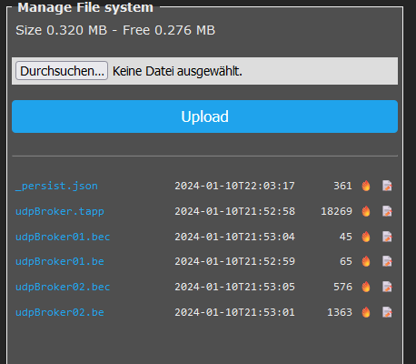

# Berry-UdpBroker
A lightweight messaging solution for Tasmota devices.


## Mission

This application implements a message broker functionality using Multicast-UDP.


## Motivation

I use Tasmota to read the values ​​from my smart meter using “scripting”.
The current electrical power is required by many other Tasmota devices.

In order to reduce further technical dependencies,
I don't use MQTT.

Therefore, another solution had to be found.


## How it works

- the application opens a Multicast-UDP-Port on IP="224.3.0.1" and PORT=12233.
- now it is able to receive all corresponding broadcast messages
- the controller can also send a broadcast message through the publish method
- publishing is also available as console-command and implements the synthax

        udppup <topic> <payload>


## How to install

Upload following files to the Tasmota-Controller

- udpBroker.tapp
- udpBroker01.be   (is executed before components are created)
- udpBroker02.be   (is after components are created)
  
After that restart the controllers and you should see following picture of the file-system.




## How to test

  We need 2 controllers (Controller-A and Controller-B) with installed udp-Broker  and following setting
  
```java
     udpBroker.infoEnable=true
 ```

  Perform following command in 'Console' of Controller-A:

```sh
  udppub global/test hello world
 ```

  You will receive on controller-B

    .... INFO broker.every_poll - got valid message:{"topic":"global/test","payload":"hello world"}

  It is also possible to perform this from berry-console using the publish-method.


```bat
  udpBroker.publish("global/test","hello world")
```

Take a look to file [udpBroker02.be](udpBroker02.be) and find how to subscribe for a topic.

## How to change parameters

